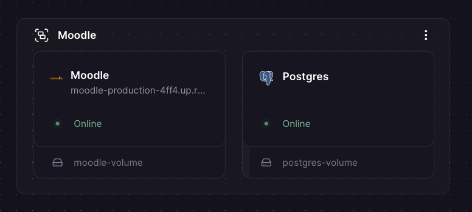
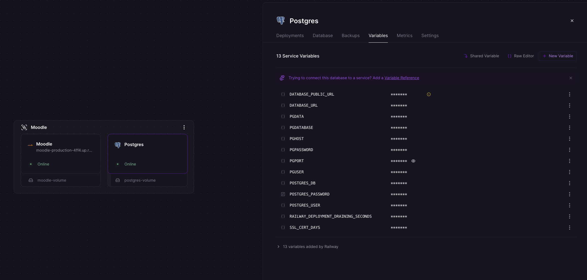

# Moodle on Railway

Quickly spin up a [Moodle](https://moodle.org) LMS sandbox on [Railway](https://railway.com) (railway.com, formerly railway.app) using Docker — ideal for development, testing, and evaluation.

> **This setup is intended for development and sandbox use only. It is not recommended for production. Use at your own risk.**

---

## Table of contents

- [What this is (and isn't)](#what-this-is-and-isnt)
- [Why Railway?](#why-railway)
- [What's in this repo](#whats-in-this-repo)
- [Deploy to Railway](#deploy-to-railway)
- [How the entrypoint works](#how-the-entrypoint-works)
- [Changing the Moodle version](#changing-the-moodle-version)
- [Troubleshooting](#troubleshooting)
- [Resources](#resources)
- [Disclaimer](#disclaimer)
- [License](#license)

---

## What this is (and isn't)

This repo gives you the fastest way to get Moodle running on Railway for:

- Local-ish development without managing a VPS
- Demoing Moodle to stakeholders
- Testing plugins, themes, or configurations
- Learning how Moodle works before committing to a production setup

**It is not hardened for production.** For a production Moodle deployment, you should consider dedicated hosting, a proper backup strategy, a tuned PHP/database configuration, and a security review.

---

## Why Railway?

Railway gives you a managed cloud platform with persistent volumes, built-in PostgreSQL/MySQL databases, automatic HTTPS, and deploy-from-GitHub — everything you need to get a Moodle sandbox running without provisioning a VPS or managing Nginx configs yourself.

---

## What's in this repo

| File | Purpose |
|------|---------|
| `Dockerfile` | Pulls the official Moodle PHP/Apache image and clones the Moodle 4.5 LTS stable branch |
| `railway-entrypoint.sh` | Fixes Apache MPM config, sets up `moodledata` permissions, and configures Railway's reverse-proxy HTTPS passthrough |

---

## Deploy to Railway

### Step 1 — Deploy the template

Click the button below to deploy this template to your Railway account. This will automatically provision the Moodle service, a PostgreSQL database, and a persistent volume for Moodle data.

[](https://railway.com/deploy/moodle-lms?referralCode=6VSPtD&utm_medium=integration&utm_source=template&utm_campaign=generic)

After the template is deployed, your Railway project will look something like this:



### Step 2 — Run the Moodle installer

Once the services are running, open your Moodle URL. You can find it in your Railway project by clicking the **Moodle** service → **Settings** → **Networking** → **Public Networking**. You'll be walked through a series of setup screens.

#### 2.1 — Language

Select your preferred language and click **Next**.

#### 2.2 — Paths

Leave the paths as they are and click **Next**.

#### 2.3 — Database

Select **PostgreSQL (native/pgsql)** as the database type and click **Next**.

#### 2.4 — Database settings

Fill in the database connection form using the credentials from your Railway PostgreSQL service:

| Field | Railway variable |
|-------|-----------------|
| **Database host** | `PGHOST` |
| **Database name** | `PGDATABASE` |
| **Database user** | `PGUSER` |
| **Database password** | `PGPASSWORD` |
| **Tables prefix** | Leave as is (prefilled) |
| **Database port** | `PGPORT` |
| **Unix socket** | Leave empty |

Copy the value of each variable from your Railway project by clicking on the **Postgres** service → **Variables** tab.



Once filled in, click **Next**.

#### 2.5 — Copyright notice

Read through the copyright notice and click **Continue**.

#### 2.6 — Server checks

Moodle will run a series of checks on your server environment. If everything shows as **OK**, click **Continue**. If any checks fail, check the build logs in your Railway project for hints.

#### 2.7 — System installation

Moodle will now run the full database installation. This may take a minute or two — you'll see a log of items being installed as it progresses. Scroll down to the bottom of the page and wait for the last item (`factor_webauthn`) to appear, then click **Continue**.

> If you land on an error page after this step, see [IP address mismatch](#ip-address-mismatch) in the Troubleshooting section.

#### 2.8 — Create main administrator account

Fill in the administrator account details as you see fit, then click **Update profile**.

#### 2.9 — Settings

Configure your site settings as you see fit, then click **Save changes**.

#### 2.10 — Register your site (optional)

You'll be prompted to register your site with Moodle HQ. This is entirely optional — skip it if you prefer, or fill in your details and submit. Either way, you're done. Your Moodle sandbox is up and running.

---

## How the entrypoint works

Railway sits behind a reverse proxy that terminates TLS. The `railway-entrypoint.sh` script handles two Railway-specific quirks:

- **HTTPS detection** — adds an Apache rule so that `X-Forwarded-Proto: https` is correctly passed to PHP as `HTTPS=on`, preventing Moodle from generating `http://` URLs for assets.
- **MPM prefork** — ensures Apache uses the `prefork` MPM (required for `mod_php`) rather than `mpm_event`, which ships as the default in some base images.

---

## Changing the Moodle version

This repo tracks the **`MOODLE_405_STABLE`** branch — Moodle's 4.5 Long Term Support (LTS) stable branch, the latest LTS version as of February 2026. This means every rebuild automatically picks up the latest patch release (bug fixes, security patches) without manually bumping a version tag.

To switch to a different Moodle version, change the branch in the `Dockerfile`:

```dockerfile
RUN git clone --depth 1 -b MOODLE_404_STABLE https://github.com/moodle/moodle.git /var/www/html \
```

Browse available stable branches and release tags on the [Moodle GitHub tags page](https://github.com/moodle/moodle/tags). Redeploy after changing the branch — Moodle's built-in upgrade script will run automatically on next visit if the new version is higher than the installed one.

> Always back up your database and volume before changing versions.

---

## Troubleshooting

### IP address mismatch

After the system installation step you may land on an error page warning about an IP address mismatch ([installhijacked](https://docs.moodle.org/405/en/error/admin/installhijacked)). This is a known side effect of Railway's reverse proxy and is not a security issue in this context. Simply **refresh the page** — it usually resolves within a few refreshes (typically less than 20). You'll then be taken to the next step automatically.

### Permission errors on moodledata

The entrypoint sets ownership and permissions on `/var/www/moodledata` at startup. If you see permission errors, confirm the volume is mounted at exactly `/var/www/moodledata`.

### "Database connection failed" on installer

Double-check that the values entered in [step 2.4](#24--database-settings) match the actual variable values shown in the **Postgres** service → **Variables** tab in your Railway project.

### Build takes a long time

The Moodle codebase is large (~400 MB). Railway caches Docker layers — subsequent deploys that don't change the `Dockerfile` will be much faster.

---

## Resources

- [Moodle documentation](https://docs.moodle.org)
- [Railway documentation](https://docs.railway.com)
- [moodlehq/moodle-php-apache on Docker Hub](https://hub.docker.com/r/moodlehq/moodle-php-apache)
- [Moodle system requirements](https://docs.moodle.org/405/en/Installing_Moodle#Requirements)

---

## Disclaimer

This project is provided as-is for sandbox and development purposes. No guarantees are made regarding security, stability, or suitability for any particular use. **Use at your own risk.** For production Moodle deployments, refer to the [official Moodle installation documentation](https://docs.moodle.org/405/en/Installing_Moodle).

---

## License

This repository's configuration files are released under the [MIT License](https://opensource.org/licenses/MIT).

Copyright (c) 2026 Jesse J.T. Zweers

Moodle itself is licensed under the [GNU GPL v3](https://docs.moodle.org/dev/License).
